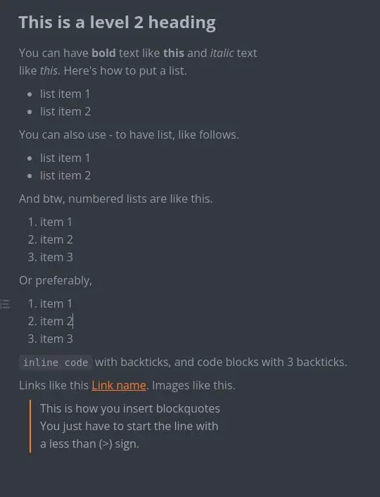

Markdown is the simplest text markup language other than gemini. I would not
be incorrect if I say markdown will only be second to gemtext and plain `.txt`
text files in terms of simplicity. Unfortunately, there are more people who don't
even know what markdown is than the people who know.

[Jump directly to markdown cheatsheet](#the-markdown-file-format)

If you want to take some notes during a lecture or during a presentation etc,
your note will mostly be plain text. Sometimes it may contain rich elements like
graphs, columned layouts etc. but those occasions are rare. 

I've seen people using softwares like MS Word to take simple notes. While that's
the most accessible way for most computer users, it's not the most efficient way
due to several reasons. I list some of them below.

- Word files (`.docx`) are complex file types.
- Word editing software are usually heavy and more resource intensive.
- Because file formats like `.docx` or `.odt` are complex, those files will
not be readable without the niche software like MS Word or LibreOffice Writer.

Because most of your notes are just plain text, you can use the plain old `.txt`
text file format to save them. Because of how lightweight text file format is,
it's very efficient to take notes in `.txt` format. You can use the old windows
notepad or a little more advanced tool like notepad++ to take plain text notes.

<div class="hr"></div>

But what if you need add little more formatting to your documents such as bold 
text, images and headings? MS Word is still not an answer because there's a 
solution which let you use all the formattings without compromising efficiency.

That solution is MARKDOWN!!!

# The markdown file format

Markdown files are just like plain old `.txt` files but the file extension needs
to be `.md` instead of `.txt`. Markdown is dead simple, I'll show you an example
which will make you understand markdown immediately. 

This is an example file called `markdown-note.md`.

```md
# This is a level one heading

This is a paragraph. The above thing is a level one heading. 
You can use upto 6 levels of heading. This is still the first
paragraph. A paragraph ends with an empty line.

This is the second paragraph. You can have as many paragraphs
as you want like this. Btw, here's a level 2 heading.

## This is a level 2 heading

You can have **bold** text like **this** and *italic* text 
like *this*. Here's how to put a list.

* list item 1
* list item 2

You can also use - to have list, like follows.

- list item 1
- list item 2 

And btw, numbered lists are like this.

1. item 1
1. item 2
1. item 3

Or preferably,

1. item 1
2. item 2
3. item 3

`inline code` with backticks, and code blocks with 3 backticks.

Links like this [Link name](https://example.com). Images like this.


> This is how you insert blockquotes
> You just have to start the line with
> a less than (>) sign.

```

As you can see, markdown format is dead simple. You don't need special software
to read a `.md` file. You can just use the plain old notepad or notepad++, but
because it's markdown, we can use markdown previewer software to see a properly
formatted output.

1. Marktext
2. Visual studio code

To download marktext, visit marktext github release page 
[here](https://github.com/marktext/marktext/releases/) and download the
`marktext-setup.exe` file for windows or `marktext-arm64.dmg` for mac.

Visual studio code is the ultra powerful option. To preview a markdown file
in VS Code, press `ctrl+shit+v` while opening the markdown file. Download
VS code [here](https://code.visualstudio.com/).



If you find this article useful, you are free to share, but more than that,
I invite you to look more about this if you feel like this article is not
enough. Here's a good [starting point](https://commonmark.org/help/) other
than [google.com](https://google.com/).